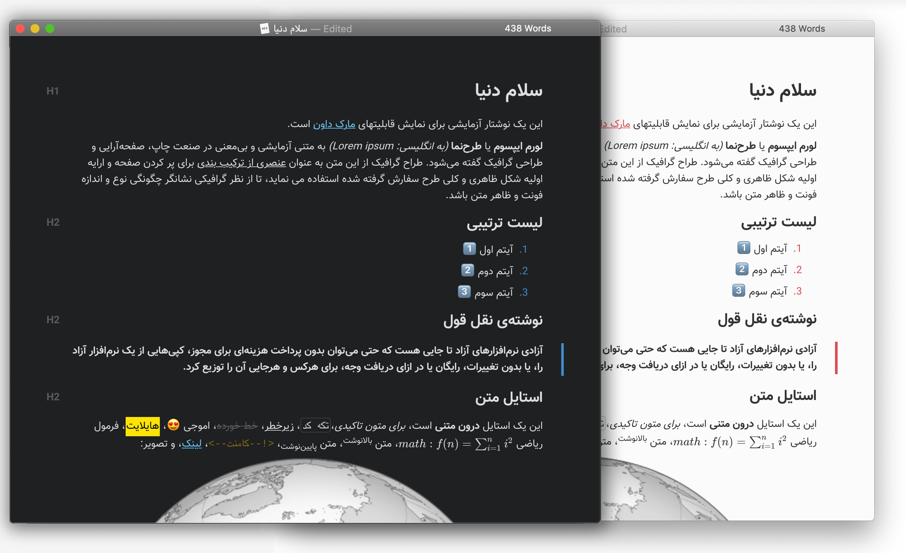

# Middle East Night Left-to-Right (Typora Theme)

This reposatory builds on an  but making it usable for those that write Left to Right

## Installation

Download **middle-east-night.css**. In Typora's preferences windows, go to `General -> Themes` and click on `Open Theme Folder`. Drop **middle-east-night.css** there, and enjoy!
